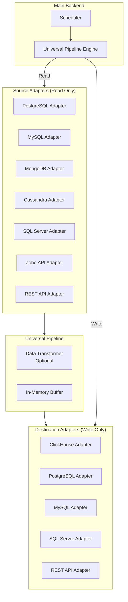

# Universal Data Pipeline Architecture

## Problem Statement

**Current Approach (Inefficient):**

- Add Cassandra → Need to create:
- `cassandra_to_clickhouse_service`
- `cassandra_to_postgresql_service`
- `cassandra_to_sqlserver_service`
- `cassandra_to_mysql_service`
- etc.
- **Result:** n sources × m destinations = exponential growth

**Better Approach:**

- Add Cassandra source adapter → Works with ALL destinations
- Add new destination adapter → Works with ALL sources
- **Result:** n sources + m destinations = linear growth

## Architecture: Adapter Pattern




## Core Concept

### Single Universal Service

**One service handles ALL migrations:**

```javascript
universal_migration_service/
├── app.py                    # Single Flask service
├── pipeline_engine.py        # Orchestrates source → dest
├── adapters/
│   ├── sources/
│   │   ├── base_source.py    # Abstract base class
│   │   ├── postgresql_source.py
│   │   ├── mysql_source.py
│   │   ├── mongodb_source.py
│   │   ├── cassandra_source.py  # NEW - works with ALL dests
│   │   └── ...
│   └── destinations/
│       ├── base_destination.py
│       ├── clickhouse_dest.py
│       ├── postgresql_dest.py
│       ├── sqlserver_dest.py
│       └── ...
└── transformers/
    └── data_transformer.py   # Optional transformations
```


## Implementation

### 1. Base Adapter Interfaces

**`adapters/sources/base_source.py`**

```python
from abc import ABC, abstractmethod
from typing import Iterator, Dict, List, Any

class BaseSourceAdapter(ABC):
    """Abstract base class for all source adapters"""
    
    @abstractmethod
    def connect(self, config: Dict[str, Any]) -> bool:
        """Establish connection to source"""
        pass
    
    @abstractmethod
    def disconnect(self):
        """Close connection"""
        pass
    
    @abstractmethod
    def get_schema(self, table_name: str) -> List[Dict[str, Any]]:
        """Get table/collection schema"""
        pass
    
    @abstractmethod
    def list_tables(self) -> List[str]:
        """List all tables/collections"""
        pass
    
    @abstractmethod
    def read_data(self, table_name: str, batch_size: int = 1000) -> Iterator[List[Dict]]:
        """Read data in batches (generator)"""
        pass
    
    @abstractmethod
    def read_incremental(self, table_name: str, last_sync_time: datetime) -> Iterator[List[Dict]]:
        """Read incremental changes"""
        pass
    
    @abstractmethod
    def get_source_type(self) -> str:
        """Return source type identifier"""
        pass
```

**`adapters/destinations/base_destination.py`**

```python
from abc import ABC, abstractmethod
from typing import List, Dict, Any

class BaseDestinationAdapter(ABC):
    """Abstract base class for all destination adapters"""
    
    @abstractmethod
    def connect(self, config: Dict[str, Any]) -> bool:
        """Establish connection to destination"""
        pass
    
    @abstractmethod
    def disconnect(self):
        """Close connection"""
        pass
    
    @abstractmethod
    def create_table(self, table_name: str, schema: List[Dict[str, Any]]):
        """Create table if not exists"""
        pass
    
    @abstractmethod
    def write_data(self, table_name: str, data: List[Dict[str, Any]], batch_size: int = 1000):
        """Write data in batches"""
        pass
    
    @abstractmethod
    def map_types(self, source_types: List[str]) -> List[str]:
        """Map source types to destination types"""
        pass
    
    @abstractmethod
    def get_destination_type(self) -> str:
        """Return destination type identifier"""
        pass
```


### 2. Universal Pipeline Engine

**`pipeline_engine.py`**

```python
from adapters.sources.base_source import BaseSourceAdapter
from adapters.destinations.base_destination import BaseDestinationAdapter
from typing import Dict, Any

class UniversalPipelineEngine:
    """Orchestrates migration from any source to any destination"""
    
    def __init__(self):
        self.source_registry = {}
        self.dest_registry = {}
    
    def register_source(self, source_type: str, adapter_class):
        """Register a source adapter"""
        self.source_registry[source_type] = adapter_class
    
    def register_destination(self, dest_type: str, adapter_class):
        """Register a destination adapter"""
        self.dest_registry[dest_type] = adapter_class
    
    def migrate(self, source_config: Dict, dest_config: Dict, 
                source_type: str, dest_type: str, 
                operation_type: str = 'full') -> Dict:
        """Execute migration"""
        
        # Get adapters
        SourceAdapter = self.source_registry.get(source_type)
        DestAdapter = self.dest_registry.get(dest_type)
        
        if not SourceAdapter or not DestAdapter:
            raise ValueError(f"Unsupported source/destination: {source_type} → {dest_type}")
        
        # Initialize adapters
        source = SourceAdapter()
        destination = DestAdapter()
        
        try:
            # Connect
            source.connect(source_config)
            destination.connect(dest_config)
            
            # Get tables to migrate
            tables = source.list_tables()
            results = {
                "success": True,
                "tables_migrated": [],
                "tables_failed": [],
                "errors": []
            }
            
            # Migrate each table
            for table_name in tables:
                try:
                    # Get schema
                    schema = source.get_schema(table_name)
                    
                    # Map types
                    dest_schema = destination.map_types(schema)
                    
                    # Create destination table
                    destination.create_table(table_name, dest_schema)
                    
                    # Migrate data
                    if operation_type == 'full':
                        data_iterator = source.read_data(table_name)
                    else:
                        data_iterator = source.read_incremental(table_name, last_sync_time)
                    
                    for batch in data_iterator:
                        destination.write_data(table_name, batch)
                    
                    results["tables_migrated"].append(table_name)
                    
                except Exception as e:
                    results["tables_failed"].append({
                        "table": table_name,
                        "error": str(e)
                    })
                    results["errors"].append(f"{table_name}: {str(e)}")
            
            results["success"] = len(results["tables_failed"]) == 0
            return results
            
        finally:
            source.disconnect()
            destination.disconnect()
```


### 3. Example: Cassandra Source Adapter

**`adapters/sources/cassandra_source.py`**

```python
from adapters.sources.base_source import BaseSourceAdapter
from cassandra.cluster import Cluster
from cassandra.auth import PlainTextAuthProvider
from typing import Iterator, List, Dict, Any
from datetime import datetime

class CassandraSourceAdapter(BaseSourceAdapter):
    """Cassandra database source adapter"""
    
    def __init__(self):
        self.cluster = None
        self.session = None
    
    def connect(self, config: Dict[str, Any]) -> bool:
        """Connect to Cassandra"""
        try:
            auth_provider = PlainTextAuthProvider(
                username=config['username'],
                password=config['password']
            )
            self.cluster = Cluster(
                [config['host']],
                port=config.get('port', 9042),
                auth_provider=auth_provider
            )
            self.session = self.cluster.connect(config['keyspace'])
            return True
        except Exception as e:
            raise ConnectionError(f"Failed to connect to Cassandra: {str(e)}")
    
    def disconnect(self):
        if self.cluster:
            self.cluster.shutdown()
    
    def list_tables(self) -> List[str]:
        """List all tables in keyspace"""
        rows = self.session.execute(
            "SELECT table_name FROM system_schema.tables WHERE keyspace_name = ?",
            [self.session.keyspace]
        )
        return [row.table_name for row in rows]
    
    def get_schema(self, table_name: str) -> List[Dict[str, Any]]:
        """Get table schema"""
        rows = self.session.execute(
            "SELECT column_name, type FROM system_schema.columns "
            "WHERE keyspace_name = ? AND table_name = ?",
            [self.session.keyspace, table_name]
        )
        return [
            {"name": row.column_name, "type": row.type}
            for row in rows
        ]
    
    def read_data(self, table_name: str, batch_size: int = 1000) -> Iterator[List[Dict]]:
        """Read data in batches"""
        query = f"SELECT * FROM {table_name}"
        rows = self.session.execute(query)
        
        batch = []
        for row in rows:
            batch.append(dict(row))
            if len(batch) >= batch_size:
                yield batch
                batch = []
        if batch:
            yield batch
    
    def get_source_type(self) -> str:
        return "cassandra"
```


### 4. Single Service Endpoint

**`app.py` (Universal Migration Service)**

```python
from flask import Flask, request, jsonify
from pipeline_engine import UniversalPipelineEngine
from adapters.sources import *
from adapters.destinations import *

app = Flask(__name__)

# Initialize pipeline engine
pipeline = UniversalPipelineEngine()

# Register all source adapters
pipeline.register_source("postgresql", PostgreSQLSourceAdapter)
pipeline.register_source("mysql", MySQLSourceAdapter)
pipeline.register_source("mongodb", MongoDBSourceAdapter)
pipeline.register_source("cassandra", CassandraSourceAdapter)  # NEW
pipeline.register_source("sqlserver", SQLServerSourceAdapter)
pipeline.register_source("zoho", ZohoSourceAdapter)

# Register all destination adapters
pipeline.register_destination("clickhouse", ClickHouseDestinationAdapter)
pipeline.register_destination("postgresql", PostgreSQLDestinationAdapter)
pipeline.register_destination("mysql", MySQLDestinationAdapter)
pipeline.register_destination("sqlserver", SQLServerDestinationAdapter)

@app.route('/migrate', methods=['POST'])
def migrate():
    """Universal migration endpoint"""
    data = request.get_json()
    
    source_type = data['source_type']  # e.g., "cassandra"
    dest_type = data['dest_type']       # e.g., "clickhouse"
    source_config = data['source']
    dest_config = data['destination']
    operation_type = data.get('operation_type', 'full')
    
    result = pipeline.migrate(
        source_config, dest_config,
        source_type, dest_type,
        operation_type
    )
    
    return jsonify(result), 200 if result['success'] else 500
```


## Adding New Database: Example with Cassandra

### Step 1: Create Source Adapter (One Time)

```bash
# Create: adapters/sources/cassandra_source.py
# Implement BaseSourceAdapter interface
# ~200-300 lines of code
```


### Step 2: Register Adapter (One Line)

```python
pipeline.register_source("cassandra", CassandraSourceAdapter)
```


### Step 3: Done!

**Cassandra now works with ALL existing destinations:**

- Cassandra → ClickHouse ✅
- Cassandra → PostgreSQL ✅
- Cassandra → SQL Server ✅
- Cassandra → MySQL ✅
- Any future destination ✅

**No need to create separate services!**

## Benefits

1. **Linear Growth**: n sources + m destinations (not n×m)
2. **Reusability**: One adapter works with all destinations
3. **Maintainability**: Fix bug in one place, benefits all combinations
4. **Consistency**: Same migration logic for all combinations
5. **Testing**: Test adapters independently

## File Structure

```javascript
Backend/
├── universal_migration_service/     # SINGLE service
│   ├── app.py
│   ├── pipeline_engine.py
│   ├── adapters/
│   │   ├── sources/
│   │   │   ├── base_source.py
│   │   │   ├── postgresql_source.py
│   │   │   ├── mysql_source.py
│   │   │   ├── mongodb_source.py
│   │   │   ├── cassandra_source.py  # NEW
│   │   │   └── ...
│   │   └── destinations/
│   │       ├── base_destination.py
│   │       ├── clickhouse_dest.py
│   │       ├── postgresql_dest.py
│   │       └── ...
│   └── transformers/
│       └── data_transformer.py
│
└── jarvis-main/
    └── app.py  # Routes to universal service
```


## Migration Path from Current Architecture

### Option A: Gradual Migration

1. Keep existing services running
2. Create universal service alongside
3. Migrate one adapter at a time
4. Deprecate old services gradually

### Option B: Refactor Existing Services

1. Extract adapters from existing services
2. Create universal pipeline engine
3. Update existing services to use adapters
4. Consolidate into single service

## Comparison

**Old Approach (Current):**

- PostgreSQL → ClickHouse: `postgres_service`
- PostgreSQL → PostgreSQL: Need new service
- MySQL → ClickHouse: Need new service
- **Total: 3 services for 3 combinations**

**New Approach (Universal):**

- PostgreSQL Source Adapter: 1 file
- ClickHouse Destination Adapter: 1 file
- MySQL Source Adapter: 1 file
- PostgreSQL Destination Adapter: 1 file
- **Total: 4 adapters handle ALL combinations (2×2=4)**

**For 5 sources × 5 destinations:**

- Old: 25 services
- New: 10 adapters (5 sources + 5 destinations)

## Implementation Checklist

When adding Cassandra: